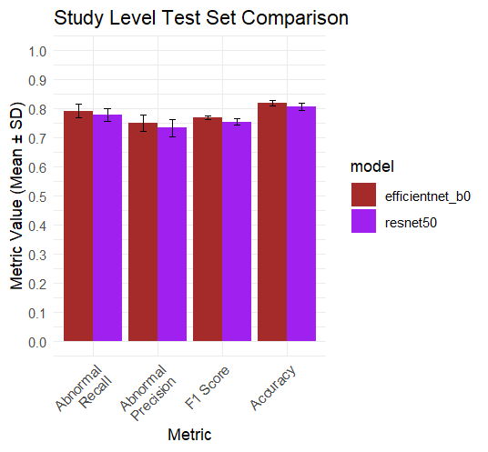
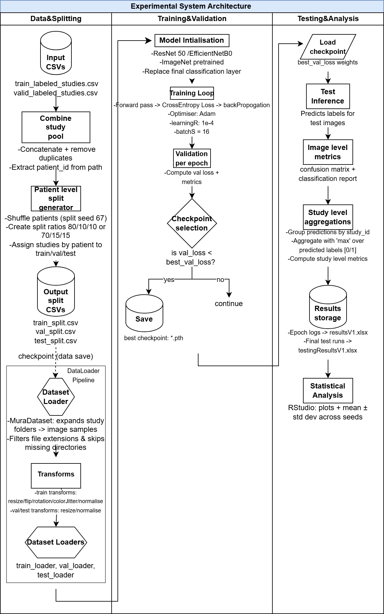
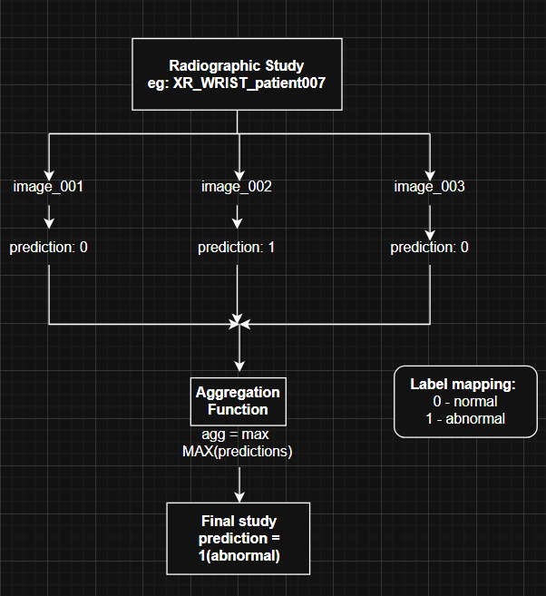
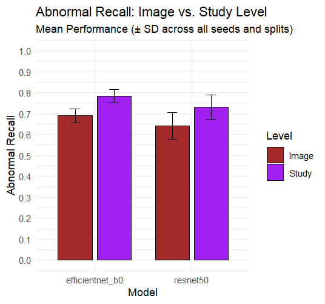

# Dissertation: ResNet50 vs EfficientNet-B0 on MURA

Final-year dissertation for my BSc Computer Science (Artificial
Intelligence) at Brunel University London. A controlled comparison of
two CNNs at detecting abnormal musculoskeletal X-rays in Stanford's MURA
dataset, scored per study and not just per image.

**Status:** in active revision for academic publication with my
supervisor, so the code and raw results aren't public yet. I can walk
through either on request.

## Result

12 runs: 2 models x 3 seeds x 2 patient-level splits, each scored on a
held-out test set. Figures are mean ± standard deviation at study level.

|                    | EfficientNet-B0 | ResNet50    |
| ------------------ | --------------- | ----------- |
| Abnormal recall    | 0.79 ± 0.02     | 0.78 ± 0.02 |
| Abnormal precision | 0.75 ± 0.03     | 0.73 ± 0.03 |
| Abnormal F1        | 0.77 ± 0.01     | 0.75 ± 0.01 |
| Accuracy           | 0.82 ± 0.01     | 0.81 ± 0.01 |
| Time per epoch     | about 157 s     | about 251 s |
| Best epoch         | 3 to 4          | 6 to 10     |
| Checkpoint size    | 16 MB           | 94 MB       |

EfficientNet-B0 shows a small but consistent advantage under this
protocol, and gets there in fewer epochs with a much smaller model. The
recall gap sits inside one standard deviation, so I don't claim it is
simply the better model.

## Method

- MURA v1.1: 40,561 X-rays from 14,863 studies of 12,173 patients
- The official train and validation sets are pooled and re-split by
  patient (80/10/10 and 70/15/15), so no patient appears in more than
  one set
- Both models start from ImageNet weights with the final layer replaced
  for normal vs abnormal
- Same settings for both: Adam, learning rate 1e-4, batch size 16,
  10 epochs, 224 px images, checkpoint kept at the lowest validation loss
- Training augmentation: horizontal flip, rotation up to 10 degrees,
  slight brightness and contrast changes
- Three training seeds (15, 21, 456) per model per split
- Grad-CAM written from the original paper, using forward and backward
  hooks on the last convolutional block
- Built in PyTorch, trained on an RTX 4060, analysed in R

## Image level vs study level

A study is a set of X-rays from one visit. A study is called abnormal if
any of its images is predicted abnormal.

On the validation sets, averaged over all epochs, this lifts abnormal
recall by about 9 points for both models.

## What the revision adds

- Confidence intervals, AUROC and confusion matrices
- Other ways of aggregating to study level (mean probability, majority
  vote)
- A breakdown by body part
- More Grad-CAM cases than the 30 or so reviewed so far

## Not in this repo

- The MURA images. Stanford's terms don't allow redistribution
- Grad-CAM figures, because they are MURA X-rays
- Trained weights
- Code and raw results, until the paper is out
