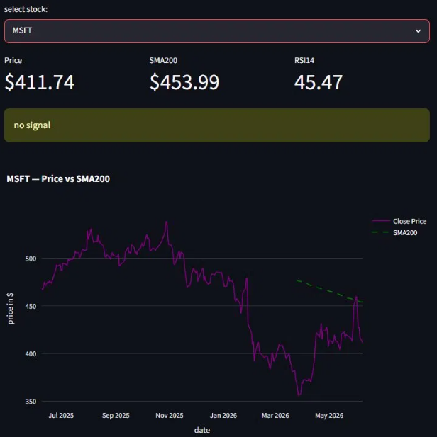

# financeEngine

A small stock screener I built for my own "swing trading". It checks a
watchlist of US large caps and flags any that are in a long term uptrend
but oversold in the short term.

## What it does

- Pulls two years of daily closing prices from Yahoo Finance
- Adds a 200-day moving average and a 14-day RSI
- Flags a buy when the close is above the SMA200 and RSI is 35 or below
- Streamlit dashboard for one ticker, or a terminal scan of the whole watchlist

## How I used it

I traded these signals with my own money from [May] to [Oct] 2026 and
logged every trade by hand in a spreadsheet: over 30 trades, majority closing in (modest) profits
The log isn't produced by this code. 
*Not financial advice*.

## Run it

    docker build -t finance-engine .
    docker run -p 8501:8501 finance-engine

Then open http://localhost:8501

Without Docker:

    pip install -r requirements.txt
    streamlit run dashboard/app.py
    python main.py

Run it after US markets close = 9pm UK. Before that, the latest row is a
live price, not a close.

## Limitations

- Entry signals only. Exits were my own call, so the results can't be
  reproduced from the code
- No backtest, but live validated
- The watchlist is hard-coded
- Alerts via mobile under construction 