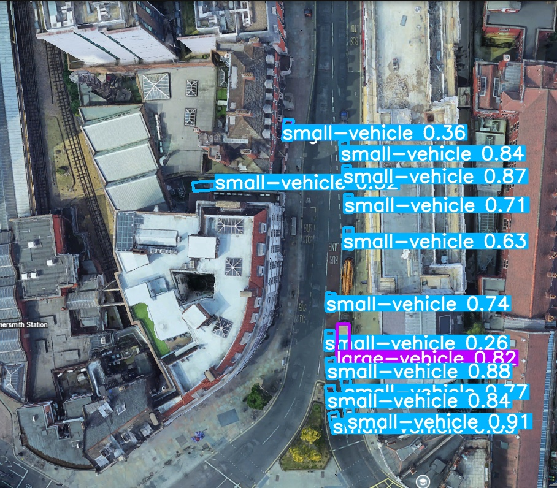
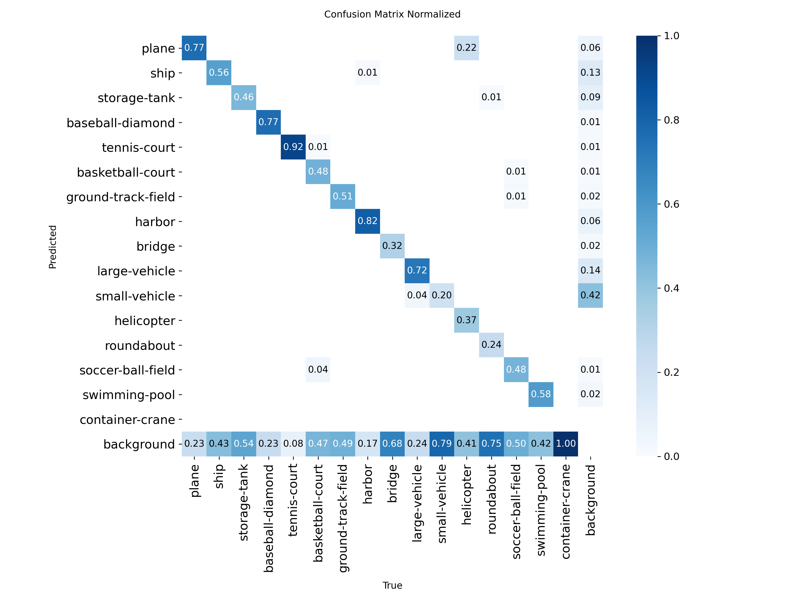

# satDetection

Oriented object detection on aerial and satellite images. I fine-tuned
YOLOv8n-OBB on DOTA v1.5 so it draws rotated boxes around 16 kinds of
object (planes, ships, vehicles, harbours, sports courts and so on),
then tried it on images it had never seen.

Imagery © Google, run through the trained model.

## Results

50 epochs on 1,411 training images, scored on 458 validation images.

| Metric    | Value |
| --------- | ----- |
| mAP50     | 0.51  |
| mAP50-95  | 0.37  |
| Precision | 0.72  |
| Recall    | 0.49  |

The starting weights were Ultralytics' yolov8n-obb.pt, which is already
trained on DOTA v1.0, so this is fine-tuning to the v1.5 labels.

It does well on large, distinctive objects (tennis courts 0.92, harbours
0.82, planes 0.77) and badly on small ones. It misses about 4 in 5 small
vehicles in the validation set and never finds a container crane.

## What's here

- scripts/conv_do_to_yo.py converts DOTA's corner-point labels into the
  normalised format YOLO-OBB expects
- scripts/train.py runs the fine-tune
- scripts/inference.py runs the model on an image and prints each
  detection with its confidence

## Run it

    pip install -r requirements.txt

Download DOTA v1.5 (not included here) and set the data path in
dataset.yaml and conv_do_to_yo.py. Then, from the project root:

    python scripts/conv_do_to_yo.py
    python scripts/train.py
    python scripts/inference.py

After converting, each split needs an images folder and a labels folder
(data/train/images, data/train/labels, and the same for val). To try
your own picture, change image_path in inference.py.

## Limitations

- No tiling. Full images are shrunk to 1,024 pixels, which is why small
  objects get missed. Slicing images into tiles is the obvious fix
- Nano model, one training run, no hyperparameter search
- In the image above it missed the orange machinery on a truck bed in
  the middle of the road
- The dataset and trained weights aren't in the repo

## Next

Comparing two passes over the same place to see what changed. I do that
by hand at the moment.
